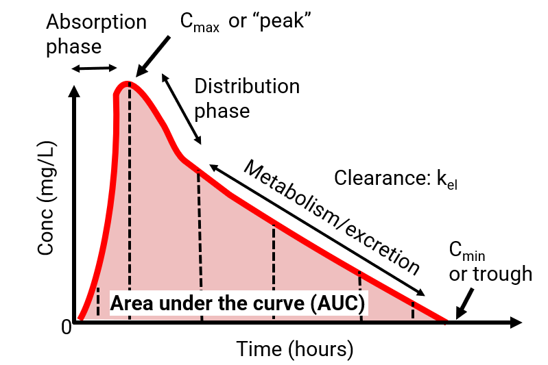
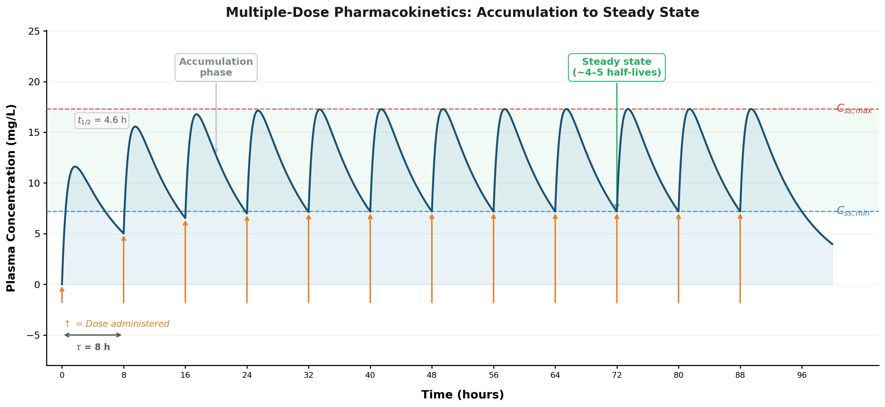
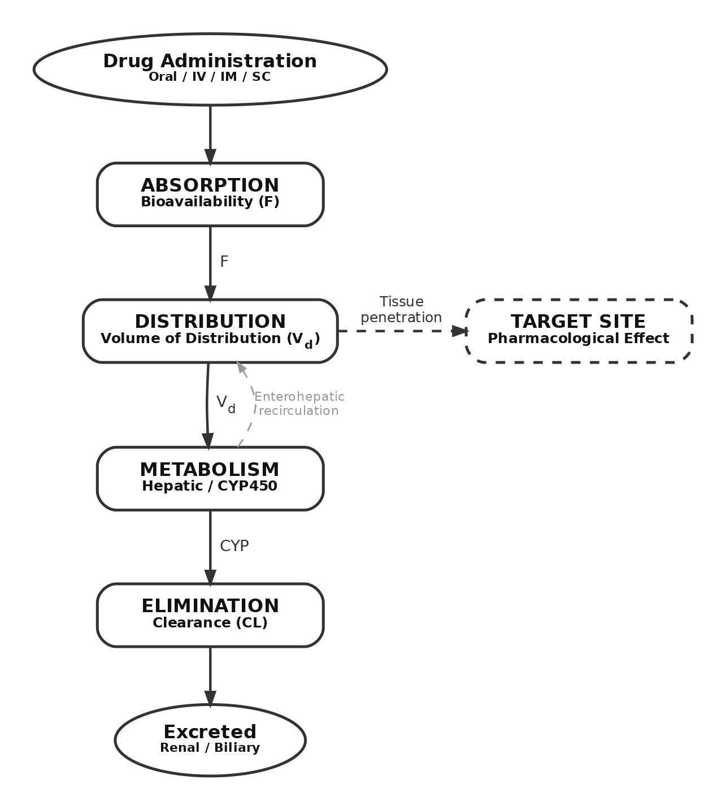

```{=html}
<style>
.reveal h2 {
  text-align: center;
  color: #9B0014;
}
</style>
```

## Pharmacokinetics and Pharmacodynamics of Antiinfective Agents {background-color="#9B0014"}

<br> <br>

<center>

Prof. Russell E. Lewis <br> Department of Molecular Medicine <br> University of Padua

<br>  russelledward.lewis\@unipd.it <br>  https://github.com/Russlewisbo

<br> slides available at: www.padovaid.com

</center>

|  |  |
|------------------------------------|------------------------------------|
| {width="150"} | {width="200"} |

## Learning objectives 
<br>

After completing this lecture, learners will be able to:

1.  Define pharmacokinetics and pharmacodynamics in the context of antiinfective therapy
2.  Explain the key pharmacokinetic parameters (ADME) and their clinical relevance
3.  Identify the three primary PK-PD indices and their associated antibiotic classes
4.  Compare concentration-dependent vs. time-dependent killing patterns
5.  Apply extended-interval and continuous infusion dosing strategies
6.  Discuss therapeutic drug monitoring principles for antiinfectives
7.  Apply PK-PD concepts to clinical case scenarios

::: {.notes}
Welcome to this lecture on PK-PD of antiinfectives. This is a 1-1.5 hour session that will provide the mathematical and conceptual framework for optimizing antiinfective dosing. We'll move from basic principles to clinical applications. Emphasize that PK-PD is unique in that it considers effects on the pathogen, host, AND microbiome.
:::


## Lecture outline

::::: columns
::: {.column width="50%"}
**Part 1: Foundations** (\~30 min)

-   Introduction to PK-PD
-   Pharmacokinetic principles (ADME)
-   Key PK parameters
-   Measuring antimicrobial potency
:::

::: {.column width="50%"}
**Part 2: Applications** (\~45 min)

-   PK-PD indices
-   Killing patterns
-   Dosing strategies
-   TDM principles
-   Clinical case studies
:::
:::::

::: {.notes}
Here's our roadmap for today. We'll spend the first 30 minutes on foundational concepts, then move into clinical applications. Feel free to ask questions as we go.
:::

## Why PK-PD Matters: A clinical vignette {.smaller}

Case Introduction

A 65-year-old man with *Pseudomonas aeruginosa* pneumonia is started on piperacillin-tazobactam 4.5g IV q8h. On day 3, he's not improving. The MIC comes back as **16 mg/L** (susceptible breakpoint).

**What would you do?**

::: {.fragment}
**Options to consider:**

-   Increase the dose?
-   Change the antibiotic?
-   Change how you give the antibiotic?

*We'll return to this case at the end of the lecture...*
:::

::: {.notes}
Let's start with a case that illustrates why PK-PD matters. This patient has a susceptible organism but isn't responding. By the end of this lecture, you'll have the tools to analyze this situation and optimize therapy. Keep this case in mind as we go through the material.
:::

# PART 1: FOUNDATIONS {background-color="#9B0014"}

## Pharmacokinetic and Pharmacodynamic Principles

---

## What is Pharmacology?

::: {.callout-note}
## Definition
**Pharmacology**: The study concerning a compound related to its history, source, physical and chemical properties, compounding, biochemical and physiologic effects, mechanisms of action and resistance, absorption, distribution, metabolism, excretion, and therapeutic and other uses
:::

**Two key components:**

- **Pharmacokinetics (PK)**: What the body does to the drug
- **Pharmacodynamics (PD)**: What the drug does to the body

::: {.notes}
Let's start with basic definitions. Pharmacology encompasses everything about a drug. For our purposes, we focus on PK (how the body handles the drug) and PD (the drug's effects). In antiinfectives, PD includes effects on the pathogen.
:::

## PK vs PD: The conceptual framework

```{dot}
digraph G {
	fontname="Lato,Arial,sans-serif"
	node [fontname="Lato,Arial,sans-serif"]
	edge [fontname="Lato,Arial,sans-serif"]


patient -> PK;
drug -> PK;
intrinsic-> PD;
acquired -> PD;
inoculum -> PD;
PK -> PKPD;
PD -> PKPD;
PKPD -> microbiological;
microbiological -> clinical;

  clinical [shape=box, label="Clinical outcome"];
  microbiological [shape=box, label="Microbiological outcome"];
  PK [shape=oval, label="Pharmacokinetics (PK)"];
  PD [shape=oval, label="Pharmacodynamics (PD)"];
  PKPD [shape=oval, label="PK/PD"];
  patient [shape=none, label="Patient factors"];
  drug [shape=none, label="Drug factors"];
  intrinsic [shape=none, label="Intrinsic resistance"];
  acquired [shape=none, label="Acquired resistance"];
  inoculum [shape=none, label="Infection inoculum"];
}
```

::: {.aside}
[@theuretzbacher2012]
:::

## Pharmacology of antimicrobials

```{dot}
digraph G {
 	rankdir=LR
 	fontname="Lato,Arial,sans-serif"
	node [fontname="Lato,Arial,sans-serif"]
	edge [fontname="Lato,Arial,sans-serif"]
 
  subgraph cluster_0 {
    style=filled;
    color=lightblue;
    node [style=filled,color=white];
    start -> dosing;
    dosing -> tissue;
    dosing -> infection;
    label = "Pharmacokinetics (PK)";
    graph [labelloc=a]
    
    
    
  }
  
    subgraph cluster_1 {
    line=black;
    style=filled;
    color=lightblue;
    node [style=filled,color=white];
  tissue->PD1
    infection-> PD2;
    label = "Pharmacodynamics (PD)";
  }
  
 
  start [shape=Box, label="Dosing regimen"];
  dosing [shape=rectangle, style=filled,color=yellow, label="Conc. vs. \n time in serum", xlabel=" \n    \n  \nAbsorption \nDistribution \nMetabolism \nElimination"];
  tissue [shape=rectangle, style=filled,color=white, label="Conc. vs. \n time in tissue"];
  infection [shape=rectangle, style=filled, color=white, label="Conc. vs. \n time at site of \n infection"];
  PD1 [shape=rectangle, label="Pharmacological or  \n toxicological effect"]; 
  PD2 [shape=rectangle, label="Antimicrobal effect \n vs. time"];
}


```

::: {.aside}
[@craig_1998]
:::

::: {.notes}
This diagram shows the relationship between PK and PD. PK determines the concentration at the site of action; PD determines what happens once the drug gets there. In antiinfectives, the "receptor" is the bacterial target, and the "effect" is killing or inhibiting the pathogen.
:::

## What makes antiinfective PK-PD unique?

<center>**Three-way relationship**</center>

<br>

:::::: columns
::: {.column width="33%"}
**Drug → Pathogen**

-   Direct antimicrobial effect
-   Kill or inhibit growth
-   Resistance selection
:::

::: {.column width="33%"}
**Drug → Host**

-   Efficacy
-   Toxicity
-   Immune modulation
:::

::: {.column width="33%"}
**Drug → Microbiome**

-   Collateral damage
-   *C. difficile* risk
-   Resistance reservoir
:::
::::::

::: {.notes}
Unlike most drugs that only affect the host, antiinfectives have a triangular relationship. This creates complexity but also opportunities for optimization. Doses are typically an order of magnitude higher than other drug classes because we're targeting non-mammalian sites. The microbiome effects are increasingly recognized as important.
:::


## The Concentration-time curve: Your roadmap

<br>

{fig-align="center"}

## The Concentration-time curve

**Key parameters from the curve:**

| Parameter            | Symbol | Definition                                |
|:---------------------|:-------|:------------------------------------------|
| Peak concentration   | C~max~ | Highest concentration achieved            |
| Trough concentration | C~min~ | Lowest concentration (before next dose)   |
| Area under curve     | AUC    | Total drug exposure over time             |
| Half-life            | t~½~   | Time for concentration to decrease by 50% |

::: {.notes}
The concentration-time curve is fundamental to PK-PD. Every dosing decision affects the shape of this curve. We measure several parameters from this curve that relate to efficacy and toxicity. Understanding how to read and manipulate this curve is essential for dose optimization.
:::


## Understanding half-life (t½)

::: {.callout-note}
## Definition

**Half-life (t½)** = Time required for the plasma concentration to decrease by 50%
:::

**Clinical implications:**

-   **Time to steady state** = 4-5 half-lives
-   **Washout time** = 4-5 half-lives
-   **Dosing interval** often based on t½

::: {.fragment}
| Drug         | Half-life | Typical Dosing        |
|:-------------|:----------|:----------------------|
| Piperacillin | 1 hour    | q6-8h                 |
| Ceftriaxone  | 8 hours   | q24h                  |
| Azithromycin | 68 hours  | Once daily × 3-5 days |
:::

::: {.notes}
Half-life determines how quickly drug accumulates and how often we need to dose. Short half-life drugs need more frequent dosing. It takes 4-5 half-lives to reach steady state. Ceftriaxone's long half-life allows once-daily dosing despite being a β-lactam.
:::


## Steady state concept

{fig-align="center" width="1200"}

**Key principles:**

-   Accumulation occurs with repeated dosing
-   Steady state = rate in equals rate out
-   Takes **4-5 half-lives** to achieve
-   Peak and trough fluctuate around average

::: {.callout-warning}
## Clinical Pearl

Don't check "steady state" levels too early—the result won't reflect true exposure!
:::

::: {.notes}
With repeated dosing, drug accumulates until we reach steady state. This is when each dose replaces exactly what was eliminated since the last dose. For aminoglycosides with a 2-hour half-life, steady state is reached in 8-10 hours. For vancomycin with a 6-hour half-life, it takes about 24-30 hours. Checking levels too early leads to incorrect dose adjustments.
:::


## ADME: The four pillars of PK

{fig-align="center" width="800"}

::: {.notes}
ADME is the backbone of pharmacokinetics. Each process has parameters we can measure and factors that affect them. Understanding these allows for dose individualization in different patient populations.
:::


## Absorption: Getting Drug Into the Body


## Bioavailability (F)

Fraction of administered dose reaching systemic circulation - IV administration: F = 100% (by definition) - Oral administration: F varies widely


**Factors affecting oral bioavailability:**

::::: columns
::: {.column width="50%"}
-   Solubility/permeability
-   Gastric pH
-   First-pass metabolism
-   Food effects
:::

::: {.column width="50%"}
-   P-glycoprotein efflux
-   Drug interactions
-   Formulation
-   GI disease
:::
:::::

::: {.notes}
Bioavailability tells us how much drug actually gets into the bloodstream. IV is our reference (100%). Oral bioavailability varies enormously—from nearly 100% for fluoroquinolones to very low for vancomycin (oral vancomycin stays in the gut). First-pass metabolism by gut and liver CYP enzymes can dramatically reduce bioavailability.
:::


## Clinical Examples: Bioavailability

| Drug                      | Oral Bioavailability | Clinical Note     |
|:--------------------------|:---------------------|:------------------|
| Levofloxacin              | \~100%               | Oral = IV         |
| Metronidazole             | \~100%               | Oral = IV         |
| Amoxicillin               | 70-90%               | Good absorption   |
| Posaconazole (suspension) | Variable             | Food dependent    |
| Oral vancomycin           | \<5%                 | Stays in GI tract |

::: {.callout-important}
## IV-to-Oral Conversion

High bioavailability drugs are excellent candidates for early IV-to-oral conversion—same exposure, lower cost, earlier discharge!
:::

::: {.notes}
These examples illustrate the range of oral bioavailability. Fluoroquinolones and metronidazole have such good absorption that oral and IV are essentially interchangeable—important for antimicrobial stewardship and early discharge. Posaconazole absorption is highly food-dependent with the suspension formulation.
:::


## Enterohepatic Recirculation

```{mermaid}
%%| fig-width: 9
flowchart LR
    A[Liver] -->|Bile| B[GI Tract]
    B -->|Conjugated drug| C[Gut bacteria]
    C -->|Deconjugation| D[Free drug]
    D -->|Reabsorption| A

    style C fill:#ffcccc
```

**Clinical significance:**

-   Prolongs drug elimination
-   Antibiotics disrupting gut flora can interrupt this cycle
-   Important for: β-lactams, mycophenolic acid, oral contraceptives

::: {.callout-warning}
Antibiotics can reduce MPA levels in transplant patients → rejection risk!
:::

::: {.notes}
Enterohepatic recirculation is an often-overlooked PK concept. Drugs are conjugated in the liver, excreted in bile, deconjugated by gut bacteria, and reabsorbed. Antibiotics that disrupt gut flora can reduce levels of other medications—this is why we worry about antibiotics affecting oral contraceptive efficacy.
:::

------------------------------------------------------------------------

## Distribution: Where Does the Drug Go?

::: {.callout-note}
## Volume of Distribution (Vd)

A proportionality constant relating plasma concentration to total amount of drug in the body

$$V_d = \frac{\text{Amount of drug in body}}{\text{Plasma concentration}}$$
:::

::: {.fragment}
**Important concept:** Vd is NOT a physiologic volume!

| Vd Value | Interpretation           |
|:---------|:-------------------------|
| \~3 L    | Confined to plasma       |
| \~14 L   | Extracellular fluid      |
| \~42 L   | Total body water         |
| \>42 L   | Extensive tissue binding |
:::

::: {.notes}
Volume of distribution is a key concept that students often misunderstand. It's not a real volume—it's a mathematical relationship. A drug with Vd of 500 L isn't really distributed in 500 liters; it means the drug is extensively bound in tissues, leaving low plasma concentrations. Aminoglycosides have small Vd (stay in ECF); macrolides have huge Vd (accumulate in tissues).
:::

------------------------------------------------------------------------

## Factors Affecting Distribution

::::: columns
::: {.column width="50%"}
**Drug properties:**

-   Lipophilicity
-   Molecular size
-   Charge/ionization
-   Protein binding affinity
:::

::: {.column width="50%"}
**Patient factors:**

-   Body composition
-   Plasma proteins
-   Blood flow
-   Tissue barriers (BBB, prostate)
:::
:::::

| Drug Type          | Binding Protein      | Effect on Vd |
|:-------------------|:---------------------|:-------------|
| Acidic (β-lactams) | Albumin              | Lower Vd     |
| Basic (macrolides) | α₁-acid glycoprotein | Higher Vd    |

::: {.notes}
Distribution is affected by both drug and patient factors. Lipophilic drugs cross membranes easily and have larger Vd. Protein binding keeps drug in the plasma—acidic drugs bind albumin, basic drugs bind AAG. In critically ill patients with hypoalbuminemia, free drug levels increase, potentially affecting both efficacy and toxicity.
:::

------------------------------------------------------------------------

## Protein Binding: Clinical Significance

::: {.r-fit-text}
**Only UNBOUND drug is pharmacologically active!**
:::

::::: columns
::: {.column width="50%"}
**Why it matters:**

-   MIC testing uses unbound drug
-   Highly bound = less active drug
-   Free drug crosses membranes
-   Free drug is eliminated
:::

::: {.column width="50%"}
**Clinical scenarios:**

-   Hypoalbuminemia → ↑ free drug
-   Uremia → ↓ protein binding
-   Drug displacement interactions
-   Burns, sepsis, cirrhosis
:::
:::::

::: {.callout-important}
## Example: Ceftriaxone

85-95% protein bound → only 5-15% is active. In hypoalbuminemia, free fraction increases → potential toxicity and altered PK
:::

::: {.notes}
This is critical for antiinfectives. The MIC we measure in the lab reflects unbound drug activity. A drug that's 99% protein bound has only 1% available to kill bacteria. Changes in protein binding due to disease states can dramatically alter free drug levels. Some institutions now measure free drug concentrations for highly bound drugs like ceftriaxone.
:::

------------------------------------------------------------------------

## Metabolism: Phase I Reactions

::: {.callout-note}
## Cytochrome P450 System

Heme-containing enzymes in the liver (and gut) that oxidize drugs
:::

**Primary CYP enzymes** (by importance for drugs):

1.  **CYP3A4** ← Metabolizes \~50% of drugs
2.  CYP2D6
3.  CYP2C9/2C19
4.  CYP1A2
5.  CYP2E1

::: {.fragment}
**CYP nomenclature:** CYP**3**A**4** = Family 3, Subfamily A, Gene 4
:::

::: {.notes}
The CYP system handles phase I metabolism—oxidation, reduction, hydrolysis. CYP3A4 is the workhorse, metabolizing about half of all drugs. This is why drug interactions involving CYP3A4 are so common. The gut also has CYP3A4, contributing to first-pass metabolism.
:::

------------------------------------------------------------------------

## Genetic Polymorphism in Drug Metabolism

::: {.callout-warning}
## CYP2C19 Example

Polymorphisms create distinct metabolizer phenotypes:
:::

| Phenotype | Frequency | Clinical Effect |
|:---|:---|:---|
| Poor metabolizer | 2-5% Caucasians, 15-20% Asians | ↑ Drug levels |
| Intermediate metabolizer | 25-35% | Moderately ↑ levels |
| Extensive metabolizer | 35-50% | Normal metabolism |
| Ultrarapid metabolizer | 5-10% | ↓ Drug levels |

::: {.fragment}
**Voriconazole**: CYP2C19 poor metabolizers have **4× higher** exposure → toxicity risk
:::

::: {.notes}
Genetic polymorphisms in CYP enzymes create distinct metabolizer phenotypes. This is particularly important for voriconazole, which is metabolized by CYP2C19. Poor metabolizers (more common in Asian populations) have dramatically higher levels. This is one reason voriconazole TDM is recommended. Some institutions do pharmacogenomic testing before starting certain drugs.
:::

------------------------------------------------------------------------

## Clinical Application: PK Boosting

```{mermaid}
%%| fig-width: 9
flowchart LR
    A[Protease Inhibitor] --> B[Gut CYP3A4]
    B --> C[↓ Absorption]
    R[Ritonavir] -.->|Inhibits| B
    A --> D[↑ Bioavailability]

    style R fill:#f9f,stroke:#333
```

**Examples of boosted regimens:**

-   Lopinavir/**ritonavir** (Kaletra)
-   Darunavir/**ritonavir** or /**cobicistat**
-   Nirmatrelvir/**ritonavir** (Paxlovid)

::: {.callout-tip}
Ritonavir is used as a PK enhancer, not for its antiviral activity!
:::

::: {.notes}
We can exploit drug interactions intentionally. Ritonavir inhibits CYP3A4 so potently that we use it to boost other protease inhibitors. This allows lower doses and less frequent dosing. The same principle is used in Paxlovid for COVID-19. Cobicistat is a newer booster with no antiviral activity—it's purely a PK enhancer.
:::

------------------------------------------------------------------------

## Elimination: Renal Clearance

**Total Clearance = Renal + Nonrenal**

::::: columns
::: {.column width="50%"}
**Renal elimination mechanisms:**

1.  **Glomerular filtration**
    -   Passive, depends on GFR
    -   Only unbound drug filtered
2.  **Tubular secretion**
    -   Active transport (OAT, OCT)
    -   Can exceed GFR
3.  **Tubular reabsorption**
    -   Returns drug to circulation
:::

::: {.column width="50%"}
**Primarily renally cleared:**

-   Aminoglycosides
-   Vancomycin
-   β-lactams (most)
-   Fluoroquinolones (partial)
-   Acyclovir
-   Fluconazole
:::
:::::

::: {.notes}
Understanding elimination pathways is essential for dose adjustment. Renally cleared drugs need dose reduction in kidney disease. Tubular secretion is an active process that can be inhibited by other drugs—this is why probenecid can increase penicillin levels. The three mechanisms combine to determine total renal clearance.
:::

------------------------------------------------------------------------

## Elimination: Nonrenal Clearance

**Nonrenal routes:**

-   **Hepatic metabolism** (most common)
-   **Biliary excretion** (ceftriaxone, azithromycin)
-   **Intestinal secretion**
-   **Other** (lung, skin)

| Drug          | Primary Elimination | Dose Adjustment           |
|:--------------|:--------------------|:--------------------------|
| Ceftriaxone   | 40% biliary         | None for renal impairment |
| Metronidazole | Hepatic             | Reduce in liver failure   |
| Azithromycin  | Biliary/fecal       | None for renal impairment |

::: {.notes}
Not all drugs are renally cleared. Ceftriaxone is unique among cephalosporins—40% is excreted unchanged in bile, so no dose adjustment needed for renal impairment. This makes it useful in patients with kidney disease. Hepatic metabolism requires dose adjustment in liver failure, which is harder to predict than renal dosing.
:::

------------------------------------------------------------------------

## Measuring Antimicrobial Potency: The MIC

::: {.callout-note}
## Minimum Inhibitory Concentration (MIC)

The lowest concentration of an antimicrobial that inhibits visible growth of a microorganism after overnight incubation
:::

**Key points:**

-   Measured using serial **2-fold dilutions** (log₂ scale)
-   Values: 0.25, 0.5, 1, 2, 4, 8, 16... mg/L
-   **MIC~90~**: MIC for 90% of isolates tested
-   Does NOT measure killing—only inhibition

::: {.notes}
The MIC is fundamental to PK-PD but has limitations. It's a single point measurement that doesn't capture the dynamic in vivo situation. It's determined using doubling dilutions, so there's inherent imprecision—a true MIC of 3 would be reported as 4. MIC90 is used for epidemiologic comparisons between agents and helps set breakpoints.
:::

------------------------------------------------------------------------

## Limitations of In Vitro Parameters

::: {.callout-warning}
## What MIC Doesn't Tell Us
:::

1.  **Rate of killing** at different concentrations
2.  **Persistent effects** after drug removal (PAE)
3.  **Immune system interactions**
4.  **Resistance emergence** over time
5.  **Tissue penetration** and local concentrations
6.  **Inoculum effects** (higher bacterial loads)

:::: fragment
::: {.callout-tip}
## The Solution: PK-PD Integration

Combine MIC with pharmacokinetic parameters to predict clinical outcomes
:::
::::

::: {.notes}
The MIC is useful but incomplete. It doesn't tell us how fast bacteria are killed, whether there's persistent effect after drug removal, or how the immune system contributes. This is why we need PK-PD—integrating the MIC with drug exposure parameters gives us better predictors of clinical outcomes.
:::

------------------------------------------------------------------------

# PART 2: APPLICATIONS {background-color="#2c3e50"}

## PK-PD Indices, Dosing Strategies, and Clinical Applications

------------------------------------------------------------------------

## The Three PK-PD Indices

<!-- IMAGE NEEDED: Comprehensive PK-PD diagram showing all three indices -->

| Index          | Formula           | What It Measures                   |
|:---------------|:------------------|:-----------------------------------|
| **C~max~/MIC** | Peak ÷ MIC        | Intensity of exposure              |
| **AUC/MIC**    | AUC₀₋₂₄ ÷ MIC     | Total exposure relative to potency |
| **T \> MIC**   | \% time above MIC | Duration of effective exposure     |

:::: fragment
::: {.callout-important}
## Key Insight

The "best" index depends on the antibiotic's mechanism of action and killing characteristics
:::
::::

::: {.notes}
These three indices are the foundation of antibiotic PK-PD. Each index relates drug exposure to the MIC. Different antibiotics show strongest correlation with different indices. Choosing the right dosing strategy depends on understanding which index matters for your drug.
:::

------------------------------------------------------------------------

## PK-PD Index by Antibiotic Class

| Antibiotic Class | Primary Index           | Target                         |
|:---------------------------|:------------------------|:------------------|
| Aminoglycosides  | C~max~/MIC              | 8-10                           |
| Fluoroquinolones | AUC/MIC (or C~max~/MIC) | 30-50 (Gram+), 100-125 (Gram-) |
| β-Lactams        | T \> MIC                | 40-70% of interval             |
| Vancomycin       | AUC/MIC                 | 400-600                        |
| Daptomycin       | AUC/MIC (or C~max~/MIC) | Variable                       |
| Linezolid        | AUC/MIC                 | 80-120                         |

::: {.notes}
This table is your clinical reference. Aminoglycosides and fluoroquinolones show concentration-dependent killing—higher peaks are better. β-lactams show time-dependent killing—duration of exposure matters. Vancomycin was traditionally thought to be time-dependent, but AUC/MIC has emerged as the best predictor. These targets guide our dosing strategies.
:::

------------------------------------------------------------------------

## Concentration-Dependent Killing

::: {.r-fit-text}
**Higher concentration = Faster killing**
:::

**Characteristics:**

-   Killing rate increases with concentration
-   Significant post-antibiotic effect (PAE)
-   Optimal strategy: **Maximize the peak**

**Agents:**

-   Aminoglycosides
-   Fluoroquinolones
-   Daptomycin
-   Metronidazole
-   Amphotericin B

::: {.notes}
Concentration-dependent agents kill faster at higher concentrations—there's no ceiling effect until you reach toxic levels. They also have prolonged PAE, meaning bacteria don't regrow immediately when drug levels fall. This allows once-daily dosing: give a big dose, achieve high peak, then let levels fall during the drug-free interval while PAE persists.
:::

------------------------------------------------------------------------

## Concentration-Dependent Killing: The Evidence

::: {.callout-tip}
## Classic Study: Blaser et al.

Examined C~max~/MIC ratios for enoxacin and netilmicin against Gram-negative organisms:
:::

| C~max~/MIC Ratio | Outcome                            |
|:-----------------|:-----------------------------------|
| \< 8             | Bacterial regrowth in ALL cultures |
| ≥ 8              | Sustained killing                  |

::: {.fragment}
**Critical finding:** When antibiotics were redosed after regrowth at sub-optimal ratios, **NO killing occurred** due to resistance emergence
:::

::: {.notes}
This landmark study established the C~max~/MIC ratio of 8-10 as the target for concentration-dependent antibiotics. Below this threshold, not only did bacteria regrow, but they became resistant. This has profound implications—underdosing these agents can select for resistance. This is why we use high-dose extended-interval aminoglycoside regimens.
:::

------------------------------------------------------------------------

## Time-Dependent Killing

::: {.r-fit-text}
**Duration above MIC = Efficacy**
:::

**Characteristics:**

-   Killing rate saturates at low multiples of MIC (4×)
-   Minimal post-antibiotic effect (against Gram-negatives)
-   Optimal strategy: **Maximize time above MIC**

**Agents:**

-   Penicillins
-   Cephalosporins
-   Carbapenems
-   Aztreonam
-   Macrolides, clindamycin
-   Linezolid

::: {.notes}
Time-dependent agents show maximal killing at 4× MIC—going higher doesn't kill faster. They have minimal PAE against Gram-negatives, so bacteria start regrowing as soon as levels drop below MIC. The goal is to keep concentrations above MIC for as long as possible. This is the rationale for continuous or extended infusions.
:::

------------------------------------------------------------------------

## Time-Dependent Killing: Animal Model Evidence

::: {.callout-important}
## Classic Data: S. pneumoniae Studies

Treatment with penicillins or cephalosporins showed dramatic mortality differences:
:::

| T \> MIC                  | Mortality |
|:--------------------------|:----------|
| ≤ 20% of dosing interval  | **100%**  |
| 40-50% of dosing interval | **0-10%** |

::: {.fragment}
**Target T \> MIC:**

-   Bacteriostatic effect: 30-40%
-   Bactericidal effect: 50-70%
-   Maximum effect: ≥70%
:::

::: {.notes}
These animal studies established the T\>MIC thresholds we use today. The difference between 20% and 40-50% T\>MIC is the difference between 100% mortality and near-zero mortality. For serious infections, we aim for bactericidal targets of 50-70%. Immunocompromised patients may need even higher targets.
:::

------------------------------------------------------------------------

## Post-Antibiotic Effect (PAE)

::: {.callout-note}
## Definition

Suppression of bacterial growth that persists **after** drug concentrations fall below MIC
:::

| Antibiotic Class | PAE: Gram-negative | PAE: Gram-positive |
|:-----------------|:-------------------|:-------------------|
| Aminoglycosides  | 2-6 hours          | 2 hours            |
| Fluoroquinolones | 2-6 hours          | 2 hours            |
| Carbapenems      | 1-2 hours          | 2 hours            |
| Penicillins      | **Little/none**    | 2 hours            |
| Cephalosporins   | **Little/none**    | 2 hours            |

::: {.notes}
PAE is the continued suppression of bacterial growth after drug removal. It's caused by non-lethal damage to bacteria that takes time to repair. Aminoglycosides and fluoroquinolones have long PAE against Gram-negatives, allowing drug-free intervals. β-lactams lack PAE against Gram-negatives, meaning bacteria regrow immediately—this is why continuous infusion makes sense.
:::

------------------------------------------------------------------------

## PAE: Clinical Implications

::::: columns
::: {.column width="50%"}
**Long PAE:**

-   Allows extended dosing intervals
-   Supports once-daily dosing
-   Example: Once-daily aminoglycosides
:::

::: {.column width="50%"}
**Short/No PAE:**

-   Needs sustained concentrations
-   Consider continuous infusion
-   Example: β-lactams via extended infusion
:::
:::::

::: {.callout-tip}
## PAE Enhancement

PAE can be prolonged by: - Higher drug concentrations - Longer exposure duration - Sub-inhibitory concentrations
:::

::: {.notes}
Understanding PAE helps explain dosing strategies. Once-daily aminoglycosides work because PAE covers the drug-free interval. β-lactams against Gram-negatives need continuous exposure because bacteria start regrowing immediately. Interestingly, even sub-MIC concentrations can extend PAE—this is why the entire dosing interval contributes to efficacy.
:::

------------------------------------------------------------------------

## Methods for Studying PK-PD

Three complementary approaches:

1.  **In vitro models** (Hollow fiber)
2.  **Animal models** (Neutropenic mouse)
3.  **Clinical studies** (Human PK-PD)

::: {.fragment}
```{mermaid}
%%| fig-width: 9
flowchart LR
    A[In Vitro] --> B[Animal Models]
    B --> C[Phase I/II Trials]
    C --> D[Phase III/Clinical Use]

    style A fill:#90EE90
    style B fill:#87CEEB
    style C fill:#DDA0DD
    style D fill:#F0E68C
```
:::

::: {.notes}
PK-PD is established through a progression of studies. In vitro hollow fiber models provide controlled conditions. Animal models add immune function (or remove it for reproducibility). Clinical trials validate findings in humans. Each level informs dose selection for the next stage.
:::

------------------------------------------------------------------------

## Hollow Fiber Infection Model

<!-- IMAGE NEEDED: Hollow fiber model schematic -->

**How it works:**

-   Bacteria grow in extracapillary space
-   Drug pumped through fibers simulates human PK
-   Serial sampling measures bacterial counts
-   Can model resistance emergence

**Advantages:**

-   Precise control of drug concentrations
-   Mimics human PK profiles
-   No animal subjects

**Limitations:**

-   No immune system
-   May overestimate required doses

::: {.notes}
The hollow fiber model is the gold standard for in vitro PK-PD. It's essentially an artificial capillary system where we can precisely control drug exposure. We can simulate human PK profiles and watch bacterial populations over days. FDA now accepts hollow fiber data to support dose selection for new antibiotics.
:::

------------------------------------------------------------------------

## Translating PK-PD to Clinical Dosing

**From bench to bedside:**

1.  Identify the PK-PD index that predicts efficacy
2.  Determine the target value from preclinical studies
3.  Use Monte Carlo simulation to find doses achieving target in most patients
4.  Validate in clinical trials
5.  Apply to patient populations

::: {.callout-warning}
## Challenge

Population average doses may not achieve targets in all patients—especially critically ill!
:::

::: {.notes}
Monte Carlo simulation uses population PK data and MIC distributions to predict what percentage of patients will achieve PK-PD targets with different doses. This is how new dosing regimens are designed. The challenge is that population averages mask individual variability—critically ill patients, obese patients, and those with altered renal function may need individualized dosing.
:::

------------------------------------------------------------------------

## Extended-Interval Aminoglycoside Dosing

::: {.callout-tip}
## The Revolution in Aminoglycoside Dosing

Traditional: 1-2 mg/kg q8h → Modern: 5-7 mg/kg q24h
:::

| Parameter      | Traditional | Extended-Interval |
|:---------------|:------------|:------------------|
| Peak (C~max~)  | 5-10 mg/L   | 15-25 mg/L        |
| Trough         | \<2 mg/L    | \<1 mg/L          |
| C~max~/MIC     | Often \<8   | 8-10              |
| Nephrotoxicity | Higher      | Lower             |
| Efficacy       | Variable    | Optimized         |

::: {.notes}
Extended-interval aminoglycoside dosing is the poster child for translating PK-PD into practice. Higher doses achieve optimal Cmax/MIC ratios. The drug-free interval allows renal cortical cells to recover, reducing nephrotoxicity. Multiple meta-analyses show equal or better efficacy with less toxicity. This is now standard of care.
:::

------------------------------------------------------------------------

## Extended-Interval Aminoglycosides: Rationale

**Why it works:**

1.  **Concentration-dependent killing**: Higher peaks = better killing
2.  **Post-antibiotic effect**: Covers drug-free interval
3.  **Adaptive resistance**: Drug-free time allows resensitization
4.  **Saturable renal uptake**: Less accumulation in renal cortex

::: {.callout-important}
## Target

Achieve C~max~/MIC of **8-10** based on expected MIC~90~ of target organisms
:::

::: {.notes}
Four mechanisms explain why extended-interval dosing improves the therapeutic index. Higher peaks optimize the PK-PD target. PAE maintains suppression during the drug-free interval. Bacteria develop adaptive resistance during exposure that reverses during drug-free time. And the renal uptake mechanism saturates, so higher peaks don't proportionally increase kidney accumulation.
:::

------------------------------------------------------------------------

## β-Lactam Infusion Strategies

Three approaches:

| Strategy     | Infusion Time | T \> MIC | Daily Dose    |
|:-------------|:--------------|:---------|:--------------|
| Intermittent | 30 min        | Lowest   | Standard      |
| Extended     | 3-4 hours     | Higher   | Same or lower |
| Continuous   | 24 hours      | 100%     | Often lower   |

<!-- IMAGE NEEDED: Comparison of three infusion strategies concentration-time curves -->

::: {.notes}
For time-dependent antibiotics, extending the infusion increases T\>MIC. With extended infusion (3-4 hours), you can achieve similar T\>MIC with less total drug. Continuous infusion achieves 100% T\>MIC by definition. The choice depends on the clinical situation, organism MIC, and practical considerations.
:::

------------------------------------------------------------------------

## Extended Infusion: The Loading Dose

::: {.callout-warning}
## Critical Concept

Continuous or extended infusion **without a loading dose** delays therapeutic concentrations!
:::

<!-- IMAGE NEEDED: Comparison of continuous infusion with and without loading dose -->

**Always give a loading dose:**

-   Achieves therapeutic levels immediately
-   Critical when bacterial load is highest
-   Load = Standard intermittent dose
-   Then transition to extended/continuous infusion

::: {.notes}
This is a common mistake. Starting continuous infusion without a loading dose means it takes hours to reach therapeutic levels—during which time bacteria are multiplying freely. Always give a loading dose first, then transition to extended or continuous infusion. This is especially important in sepsis when time to effective therapy matters.
:::

------------------------------------------------------------------------

## Clinical Evidence: Extended β-Lactam Infusions

| Evidence | Findings |
|:-----------------------------------|:-----------------------------------|
| Meta-analysis (Rhodes 2018) | 1.46× lower mortality with prolonged pip-tazo |
| Meta-analysis (Falagas 2013) | Lower mortality with prolonged carbapenems |
| BLING-II RCT | Comparable 90-day survival |
| BLISS RCT | Comparable outcomes |

::: {.callout-note}
## Why RCTs Show Less Benefit

-   Selection bias in observational studies (sicker patients get standard dosing)
-   RCTs include patients who would do well either way
-   Greatest benefit likely in: high MICs, critically ill, immunocompromised
:::

::: {.notes}
The evidence is strongest from observational data showing mortality benefits with extended infusions. RCTs have shown comparable outcomes, which may reflect patient selection—patients in RCTs are often less sick than real-world populations. Extended infusion likely has greatest benefit for high-MIC organisms and critically ill patients where PK-PD target attainment is most challenging.
:::

------------------------------------------------------------------------

## Special Populations: Critically Ill Patients

**Why PK is altered in critical illness:**

::::: columns
::: {.column width="50%"}
**↑ Volume of Distribution:**

-   Third spacing
-   Fluid resuscitation
-   Hypoalbuminemia
-   Capillary leak
:::

::: {.column width="50%"}
**Altered Clearance:**

-   Augmented renal clearance (ARC)
-   Acute kidney injury
-   CRRT
-   Hepatic dysfunction
:::
:::::

::: {.callout-important}
Standard doses often **underdose** critically ill patients initially, then **overdose** as organ function changes
:::

::: {.notes}
Critically ill patients are the hardest to dose. Early in sepsis, volume expands dramatically, diluting drugs. ARC (GFR \>130 mL/min) is common in young septic patients—they clear drugs faster than normal. Then organ failure develops and clearance drops. Standard doses often fail to achieve targets. This population benefits most from TDM and individualized dosing.
:::

------------------------------------------------------------------------

## Therapeutic Drug Monitoring: Principles

**When is TDM valuable?**

1.  Narrow therapeutic index
2.  High interpatient variability
3.  Poorly predictable PK
4.  Defined PK-PD targets
5.  Concentration-related toxicity
6.  Clinical consequences of under/overdosing

::: {.callout-tip}
## Commonly Monitored Antiinfectives

Aminoglycosides, vancomycin, voriconazole, posaconazole, flucytosine
:::

::: {.notes}
TDM isn't useful for all drugs—it requires defined targets and situations where measurements will change management. Aminoglycosides have narrow therapeutic indices. Vancomycin has variable PK and defined AUC targets. Voriconazole has genetic polymorphism affecting metabolism. For each drug, know WHY you're monitoring and WHAT you'll do with the result.
:::

------------------------------------------------------------------------

## Vancomycin: Evolution of Monitoring

::::: columns
::: {.column width="50%"}
**Old Paradigm:**

-   Target: Trough 15-20 mg/L
-   Simple to implement
-   "Higher trough = better"
-   Associated with nephrotoxicity
:::

::: {.column width="50%"}
**New Paradigm (2020 Guidelines):**

-   Target: AUC/MIC 400-600
-   AUC-based dosing
-   Requires 2 samples or Bayesian
-   Better precision, less toxicity
:::
:::::

:::: fragment
::: {.callout-important}
## Key Change

Troughs of 15-20 mg/L often give **AUC/MIC \>600** → increased nephrotoxicity without added benefit
:::
::::

::: {.notes}
This is a major practice change. For years we targeted troughs of 15-20, but this often resulted in excessive AUC and nephrotoxicity. The 2020 consensus guidelines recommend AUC-based monitoring targeting 400-600. This can be done with two samples (peak and trough) or with Bayesian software using a single trough. The shift requires new workflows but reduces toxicity.
:::

------------------------------------------------------------------------

## Vancomycin AUC Estimation Methods

**Option 1: Two-Sample Method**

-   Draw peak (1-2h post-infusion) and trough (before next dose)
-   Calculate AUC using first-order equations
-   More accurate, more complex

**Option 2: Bayesian Estimation**

-   Single trough concentration
-   Population PK model + patient covariates
-   Software estimates individual PK parameters
-   Predicts AUC from one level

::: {.callout-tip}
## Practical Tip

Many institutions are implementing Bayesian vancomycin dosing software (e.g., DoseMeRx, InsightRx)
:::

::: {.notes}
AUC-based vancomycin monitoring can be implemented two ways. The two-sample method is more accurate but requires two blood draws. Bayesian estimation uses a population model refined by the patient's trough—software does the math. Either method is better than trough-only monitoring. Check what resources your institution has available.
:::

------------------------------------------------------------------------

## Antifungal TDM: Azoles

**Why TDM is important for azoles:**

| Drug         | Issue                     | Target Range |
|:-------------|:--------------------------|:-------------|
| Voriconazole | CYP2C19 polymorphism      | 1-5 mg/L     |
| Itraconazole | Variable absorption       | ≥0.5-1 mg/L  |
| Posaconazole | Food-dependent absorption | ≥0.7-1 mg/L  |

::: {.callout-warning}
## Voriconazole Toxicity

Levels \>5.5 mg/L associated with: - Visual disturbances - Hepatotoxicity - CNS effects - Hallucinations
:::

::: {.notes}
Azole antifungals have highly variable PK making TDM valuable. Voriconazole is metabolized by polymorphic CYP2C19—poor metabolizers can have toxic levels on standard doses. Posaconazole suspension requires fat for absorption. Newer formulations (tablets, IV) are more reliable. For serious fungal infections, TDM helps ensure adequate exposure.
:::

------------------------------------------------------------------------

## Antiretroviral PK-PD: Unique Considerations

**What makes ARVs different:**

-   Site of action: **Inside mammalian cells**
-   Many require intracellular activation (NRTIs → triphosphates)
-   Plasma levels may not reflect site concentrations
-   Combination therapy is standard

:::: fragment
::: {.callout-note}
## The Therapeutic Window

Antiretrovirals must achieve concentrations that: - Suppress viral replication (efficacy) - Don't cause toxicity - Prevent resistance emergence
:::
::::

::: {.notes}
Antiretrovirals present unique PK-PD challenges. Many work inside cells where we can't easily measure concentrations. NRTIs must be phosphorylated to their active triphosphate forms—plasma parent drug levels don't predict intracellular metabolite levels. Combination therapy exploits synergy to widen the therapeutic window.
:::

------------------------------------------------------------------------

## Case Study 1: Aminoglycoside Dosing

::: {.callout-tip}
## Clinical Scenario

62-year-old man, 80 kg, CrCl 90 mL/min, with hospital-acquired pneumonia. You want to start tobramycin. MIC~90~ of *P. aeruginosa* at your hospital is 2 mg/L.

**Traditional dosing:** 1.5 mg/kg q8h = 120 mg q8h **Peak expected:** \~5-6 mg/L → C~max~/MIC = 2.5-3 ❌

**Extended-interval:** 7 mg/kg q24h = 560 mg q24h **Peak expected:** \~20 mg/L → C~max~/MIC = 10 ✓
:::

::: {.fragment}
**Answer:** Extended-interval dosing achieves the PK-PD target of 8-10
:::

::: {.notes}
Let's apply what we've learned. With traditional dosing, the peak is too low to achieve the target Cmax/MIC of 8-10. Extended-interval dosing with 7 mg/kg gives a peak around 20 mg/L, achieving Cmax/MIC of 10. This optimizes efficacy while the drug-free interval reduces nephrotoxicity risk.
:::

------------------------------------------------------------------------

## Case Study 2: β-Lactam Optimization

::: {.callout-tip}
## Clinical Scenario

55-year-old woman with *P. aeruginosa* bloodstream infection. Piperacillin MIC = 16 mg/L (susceptible). Started on pip-tazo 4.5g q8h (30-min infusion).

Day 3: Still febrile, blood cultures remain positive.
:::

**Analysis:**

-   β-lactam → Time-dependent killing → T \> MIC matters
-   With MIC of 16 mg/L, standard dosing achieves T \> MIC of only \~30%
-   Target: T \> MIC ≥50%

::: {.fragment}
**Solution:** Extended infusion 4.5g q8h over 4 hours (with loading dose) OR increase to q6h dosing
:::

::: {.notes}
This is our opening case! The organism is susceptible, but the MIC is at the high end. Standard 30-minute infusions don't maintain levels above 16 mg/L long enough. Extended infusion over 4 hours maintains higher trough concentrations, increasing T\>MIC to \>50%. Alternatively, more frequent dosing (q6h) also increases T\>MIC. This is PK-PD in action.
:::

------------------------------------------------------------------------

## Case Study 3: Vancomycin Monitoring

::: {.callout-tip}
## Clinical Scenario

45-year-old man with MRSA bacteremia (MIC = 1 mg/L). Started on vancomycin 1.5g q12h. Day 3 trough = 22 mg/L.

**Old approach:** Trough in target range (15-20)—maybe even too high. Continue same dose?

**New approach:** Using Bayesian software, estimated AUC = 680 mg·h/L - AUC/MIC = 680 (target: 400-600) - This patient is **overexposed** → nephrotoxicity risk
:::

::: {.fragment}
**Action:** Reduce dose to target AUC/MIC of 400-600
:::

::: {.notes}
This case illustrates why AUC-based monitoring is better than troughs. A trough of 22 looks borderline acceptable under the old paradigm. But the estimated AUC is 680—well above the 400-600 target. This patient has unnecessary exposure and increased nephrotoxicity risk. AUC-based monitoring would catch this and prompt dose reduction.
:::

------------------------------------------------------------------------

## Return to Opening Case

::: {.callout-tip}
## Remember Our Patient?

65-year-old man with *P. aeruginosa* pneumonia on pip-tazo 4.5g q8h, not improving. MIC = 16 mg/L.
:::

**Now you can answer:**

1.  **What's the relevant PK-PD index?** T \> MIC (β-lactam)
2.  **Is the target being achieved?** Likely not with high MIC
3.  **What's your recommendation?**
    -   Extended infusion (4.5g over 4h q8h) with loading dose
    -   OR increase frequency to q6h
    -   Consider combination therapy
4.  **Why not just increase the dose?** Extending infusion increases T \> MIC more efficiently than higher doses

::: {.notes}
Now we can fully analyze this case. The patient isn't responding because standard pip-tazo dosing doesn't achieve adequate T\>MIC for an organism with MIC of 16. Extended infusion is the most efficient fix—it increases T\>MIC without increasing total drug exposure. This is exactly how PK-PD guides clinical decisions.
:::

------------------------------------------------------------------------

## Summary: Key Clinical Pearls

1.  **Know your PK-PD index:**
    -   C~max~/MIC: aminoglycosides, fluoroquinolones
    -   AUC/MIC: vancomycin, fluoroquinolones
    -   T \> MIC: β-lactams
2.  **Match dosing strategy to PK-PD:**
    -   Concentration-dependent → maximize peak
    -   Time-dependent → maximize duration
3.  **Remember special populations:**
    -   Critically ill patients often need higher/more frequent doses initially
    -   TDM helps individualize therapy

::: {.notes}
Let's consolidate the key takeaways. Know which index predicts efficacy for each drug class. Design dosing strategies that optimize that index. Recognize that standard doses don't work for everyone—critically ill patients especially need individualized approaches. TDM is valuable when targets are known and variability is high.
:::

------------------------------------------------------------------------

## Summary: Dosing Strategy Quick Reference

| Drug Class | Strategy | Rationale |
|:-------------------------|:---------------------|:-----------------------|
| Aminoglycosides | Once-daily high dose | Optimize C~max~/MIC, minimize toxicity |
| Fluoroquinolones | Higher doses when possible | C~max~/MIC and AUC/MIC |
| β-Lactams | Extended/continuous infusion | Maximize T \> MIC |
| Vancomycin | AUC-based dosing | Target AUC/MIC 400-600 |
| Azoles | TDM-guided | High variability |

::: {.notes}
Here's your quick reference card. Aminoglycosides: once-daily. β-lactams: extended infusion when needed. Vancomycin: AUC-based dosing. Azoles: TDM. These principles apply across most clinical situations. Adapt based on organism MIC and patient factors.
:::

------------------------------------------------------------------------

## Take-Home Messages

1.  **PK-PD integration** is essential for optimizing antiinfective therapy

2.  **Underdosing is common** and promotes resistance

3.  **One size doesn't fit all**—individualize based on patient and pathogen

4.  **Extended/continuous infusions** can rescue patients failing standard β-lactam dosing

5.  **TDM** is your tool for precision antiinfective therapy

6.  **Apply these principles** every time you write an antibiotic order!

::: {.notes}
These are the messages I hope you'll remember tomorrow. PK-PD isn't just academic—it directly impacts patient outcomes. Think about PK-PD every time you prescribe an antibiotic. Ask yourself: Am I achieving the right target for this drug, this organism, this patient? If not, how can I optimize?
:::

------------------------------------------------------------------------

## Questions & Discussion {.center}

::: {.r-fit-text}
**Thank you!**
:::

**Key resources:**

-   EUCAST: www.eucast.org
-   CLSI breakpoint tables
-   Sanford Guide
-   ID Stewardship pharmacist consultation

------------------------------------------------------------------------

## References {.smaller}

::: {#refs}
:::

------------------------------------------------------------------------

## Supplementary: PK Abbreviations Reference {.smaller}

| Abbreviation | Definition                              |
|:-------------|:----------------------------------------|
| F            | Bioavailability                         |
| V~d~         | Volume of distribution                  |
| CL           | Clearance                               |
| t~½~         | Half-life                               |
| C~max~       | Maximum concentration                   |
| C~min~       | Minimum/trough concentration            |
| AUC          | Area under the concentration-time curve |
| MIC          | Minimum inhibitory concentration        |
| PAE          | Post-antibiotic effect                  |
| T \> MIC     | Time above MIC                          |
| TDM          | Therapeutic drug monitoring             |